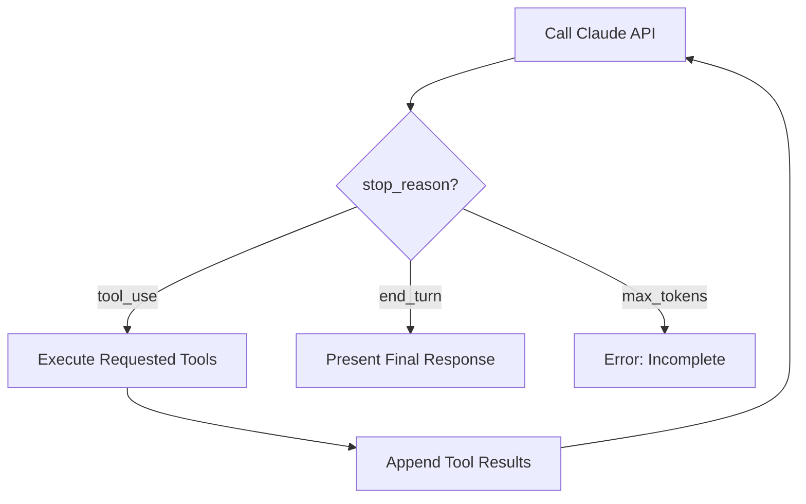
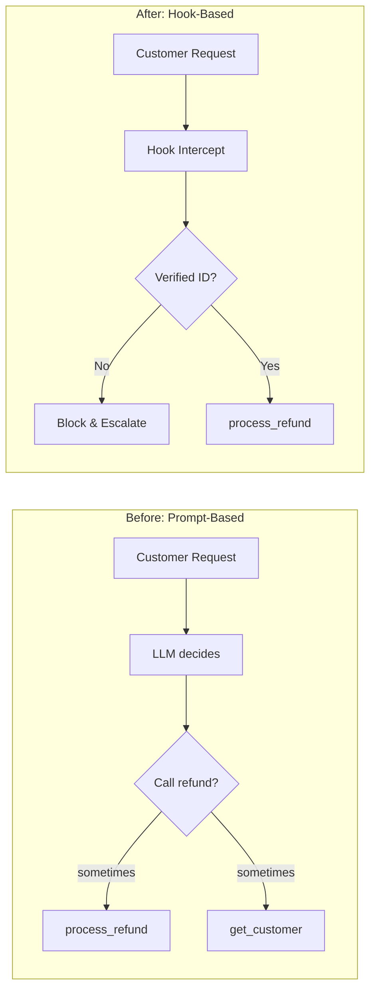
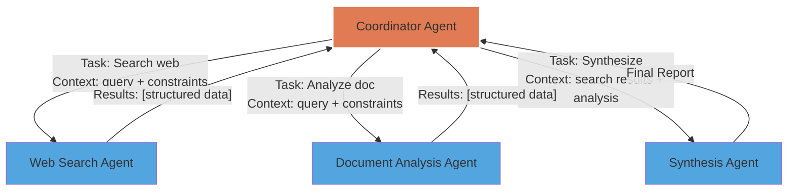
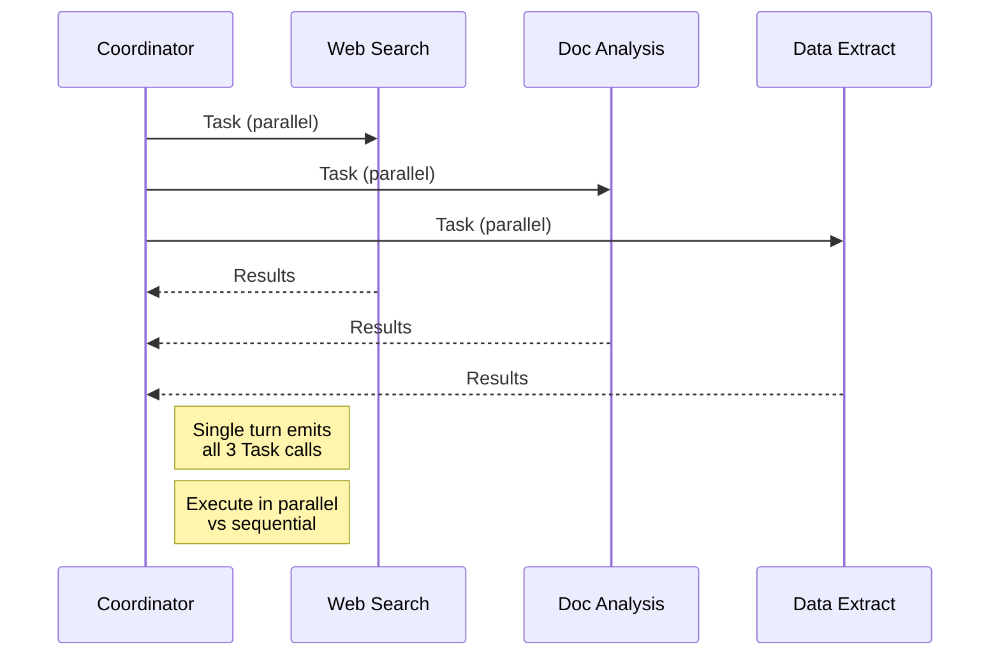
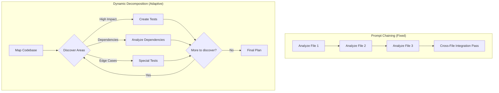
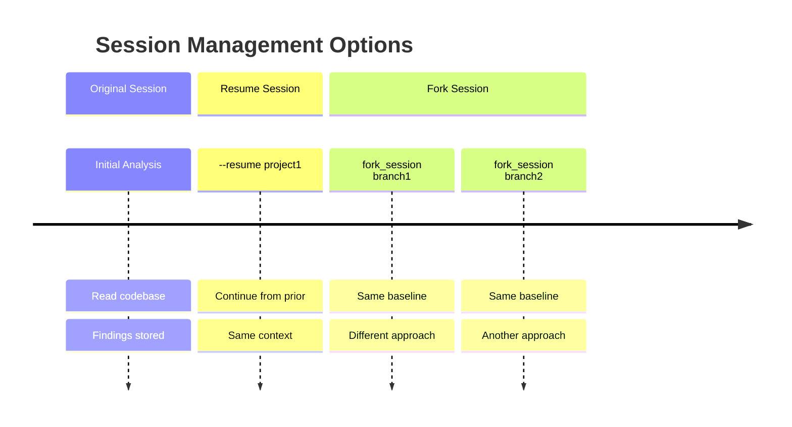
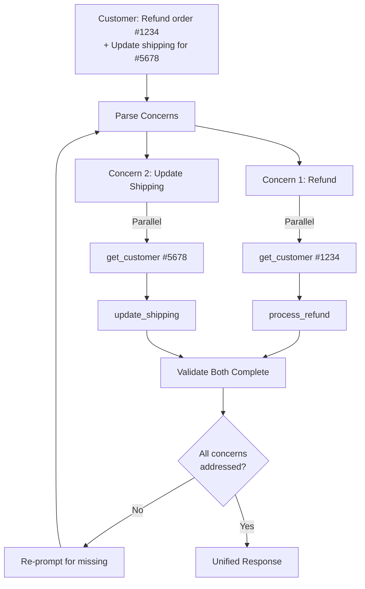
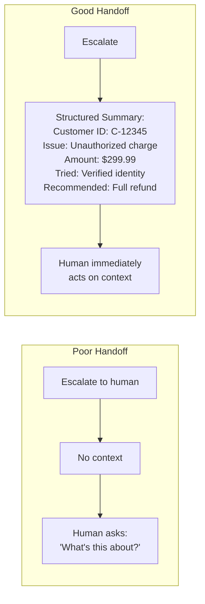
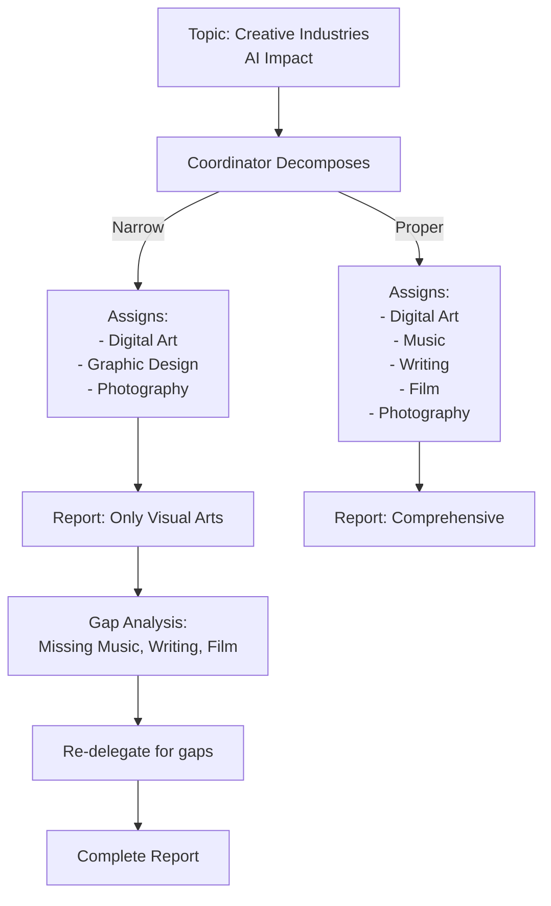

# Domain 1: Agentic Architecture & Orchestration (27%)

---

## Card 1.1: Agentic Loop Control

### Question
What determines when to continue vs stop an agentic loop?

### Answer
**Check the `stop_reason` field:**
- Continue when `stop_reason === "tool_use"`
- Stop when `stop_reason === "end_turn"`

### Key Concept: Anti-patterns to Avoid
> Avoid parsing natural language signals, using arbitrary iteration caps as primary stopping mechanism, or checking assistant text content for completion indicators.

---

## Card 1.2: Programmatic Prerequisites

### Question
How do you implement a programmatic prerequisite for critical business rules?

### Answer
**Use hooks to enforce deterministic compliance:**
- Block downstream tool calls until prerequisites complete (e.g., block `process_refund` until `get_customer` returns verified ID)
- Implement PostToolUse hooks for data normalization
- Intercept tool calls to block policy violations (e.g., refunds above $500)

### Key Concept
> Prompt-based enforcement has non-zero failure rate. Use hooks when deterministic compliance is required for critical operations.

---

## Card 1.3: Hub-and-Spoke Architecture

### Question
What is the hub-and-spoke architecture in multi-agent systems?

### Answer
**Coordinator manages all communication:**
- Coordinator agent handles all inter-subagent communication, error handling, and information routing
- Subagents operate with isolated context—they don't inherit coordinator's conversation history automatically
- Coordinator decomposes tasks, delegates, aggregates results, and selects which subagents to invoke

### Key Concept: Context Passing
> Include complete findings from prior agents directly in the subagent's prompt. Use structured data formats to separate content from metadata (source URLs, document names, page numbers).

---

## Card 1.4: Parallel Subagent Execution

### Question
How do you spawn parallel subagents?

### Answer
**Emit multiple Task tool calls in a single coordinator response:**
- Include "Task" in allowedTools for the coordinator
- Spawn parallel subagents by emitting multiple Task calls in one response rather than across separate turns
- Each subagent receives explicit context in its prompt

### Example
When researching a topic, spawn web search, document analysis, and data extraction agents simultaneously from a single coordinator turn.

---

## Card 1.5: Task Decomposition Patterns

### Question
What's the difference between prompt chaining and dynamic decomposition?

### Answer
**Use appropriate pattern for the workflow:**
- **Prompt chaining:** Fixed sequential pipelines for predictable multi-aspect reviews (e.g., analyze each file individually, then cross-file integration pass)
- **Dynamic decomposition:** Adaptive plans that generate subtasks based on intermediate findings for open-ended investigation

### Key Concept
> **Code review:** Use prompt chaining (per-file analysis → cross-file integration). **Legacy codebase testing:** Use dynamic decomposition (map structure → identify high-impact areas → create prioritized adaptive plan).

---

## Card 1.6: Session Management

### Question
How do you manage session state and resumption?

### Answer
**Session management strategies:**
- Use `--resume <session-name>` to continue specific prior conversations
- Use `fork_session` to create independent branches from shared analysis baseline
- Start fresh with injected summaries when prior tool results are stale rather than resuming with stale context

### Best Practice
> Inform a resumed session about specific file changes for targeted re-analysis rather than requiring full re-exploration.

---

## Card 1.7: Multi-Concern Requests

### Question
What's the most reliable way to handle multi-concern customer requests?

### Answer
**Decompose and handle in parallel:**
- Decompose multi-concern requests into distinct items
- Investigate each in parallel using shared context
- Synthesize unified resolution

### Key Concept
> Response validation detects incomplete responses and automatically re-prompts the agent to address missed concerns. This is more effective than preprocessing layers or few-shot examples alone.

---

## Card 1.8: Handoff Summaries

### Question
How should you structure handoff summaries for escalation?

### Answer
**Include structured context for human agents:**
- Customer ID and relevant identifiers
- Root cause analysis
- Refund amounts or relevant values
- Recommended actions
- What has already been attempted

### Why Structured?
> Human agents may lack access to the conversation transcript. Structured handoff summaries enable them to take over effectively.

---

## Card 1.9: Task Decomposition Risks

### Question
What's the risk of overly narrow task decomposition by the coordinator?

### Answer
**Incomplete coverage of broad topics:**
- Coordinator may decompose "creative industries" into only visual arts (digital art, graphic design, photography)
- Completely misses music, writing, and film
- Subagents execute correctly—the problem is what they were assigned

### Solution
> Implement iterative refinement loops where coordinator evaluates synthesis output for gaps and re-delegates with targeted queries until coverage is sufficient.

