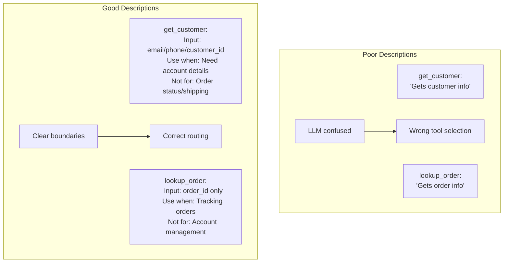
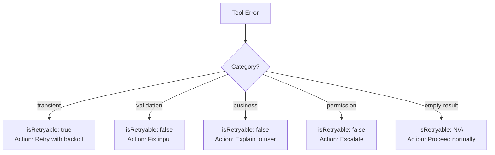
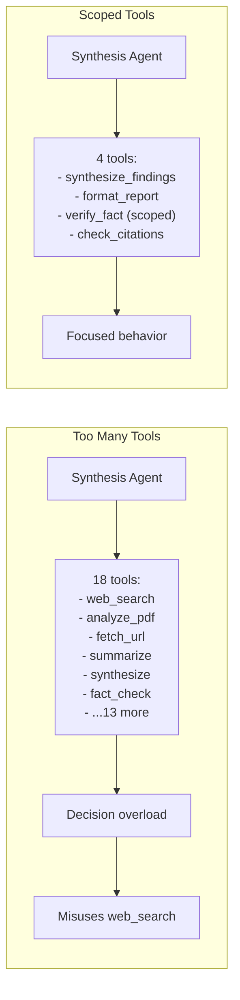
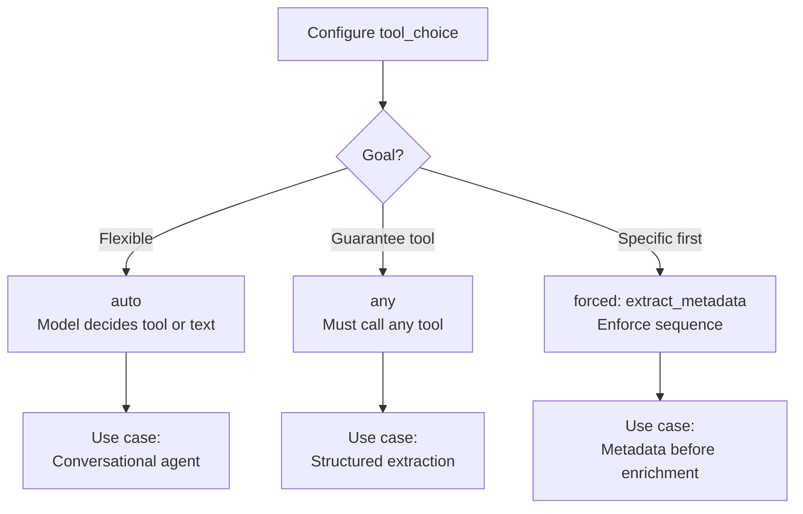
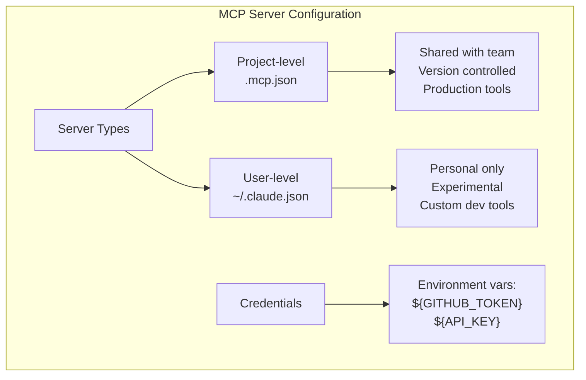
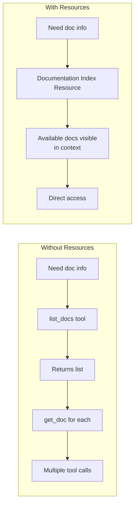
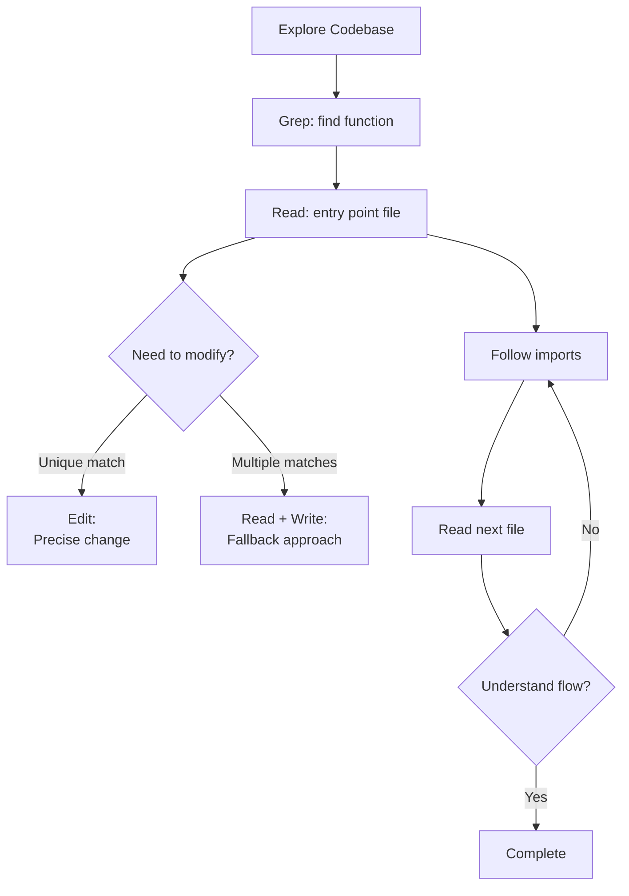

# Domain 2: Tool Design & MCP Integration (18%)

---

## Card 2.1: Effective Tool Descriptions

### Question
What makes an effective tool description?

### Answer
**Clear differentiation and boundaries:**
- Expected input formats and example queries
- Edge cases and boundary explanations
- When to use this tool versus similar alternatives

### Common Mistake
> Minimal descriptions like "Retrieves customer information" lead to unreliable selection. Ambiguous descriptions cause misrouting (e.g., analyze_content vs analyze_document with near-identical descriptions).

---

## Card 2.2: Structured Error Responses

### Question
How do you handle structured error responses in MCP tools?

### Answer
**Return structured error metadata:**
- `errorCategory`: transient / validation / permission / business
- `isRetryable`: boolean flag
- Human-readable descriptions
- Partial results and what was attempted

### Why It Matters
> Generic "Operation failed" responses prevent the agent from making appropriate recovery decisions. Distinguish access failures (need retry) from valid empty results (successful query with no matches).

---

## Card 2.3: Optimal Tool Count

### Question
What's the optimal number of tools per agent?

### Answer
**Limit to 4-5 relevant tools per agent:**
- Too many tools (e.g., 18 instead of 4-5) degrades selection reliability by increasing decision complexity
- Agents with tools outside their specialization tend to misuse them
- Provide scoped cross-role tools for high-frequency needs

### Example
> Synthesis agent shouldn't have web search tools, but can have a scoped verify_fact tool for simple lookups.

---

## Card 2.4: Tool Choice Configuration

### Question
What are the tool_choice configuration options?

### Answer
**Control tool selection behavior:**
- `"auto"`: Model may return text instead of calling a tool
- `"any"`: Model must call a tool but can choose which (guarantees structured output)
- `{"type": "tool", "name": "..."}`: Force specific tool selection

### Use Cases
> Use "any" to guarantee structured output. Use forced selection to ensure metadata extraction runs before enrichment steps.

---

## Card 2.5: MCP Server Scoping

### Question
Where should MCP servers be configured?

### Answer
**Scope appropriately:**
- **Project-level (.mcp.json):** Shared team tooling, version-controlled
- **User-level (~/.claude.json):** Personal/experimental servers
- Environment variable expansion for credentials: `${GITHUB_TOKEN}`

### Best Practice
> Choose existing community MCP servers over custom implementations for standard integrations (e.g., Jira). Reserve custom servers for team-specific workflows.

---

## Card 2.6: MCP Resources vs Tools

### Question
When should you use MCP resources vs tools?

### Answer
**Different purposes:**
- **Resources:** Expose content catalogs (issue summaries, documentation hierarchies, database schemas) to reduce exploratory tool calls
- **Tools:** Actions that perform operations

### Resource Example
> Expose a "documentation_index" resource so the agent can see available docs without calling multiple list/search tools.

---

## Card 2.7: Built-in Tool Selection

### Question
How do you select between built-in tools (Read, Write, Edit, Bash, Grep, Glob)?

### Answer
**Use the right tool for the task:**
- **Grep:** Search file contents for patterns (function names, error messages, imports)
- **Glob:** Find files by name/extension patterns (`**/*.test.tsx`)
- **Edit:** Targeted modifications with unique text matching
- **Read + Write:** Fallback when Edit can't find unique anchor text

### Exploration Pattern
> Start with Grep to find entry points, then Read to follow imports and trace flows—rather than reading all files upfront.

