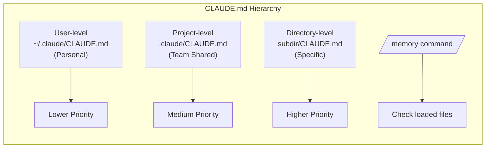
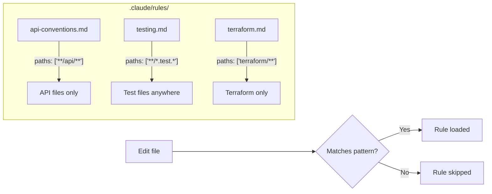
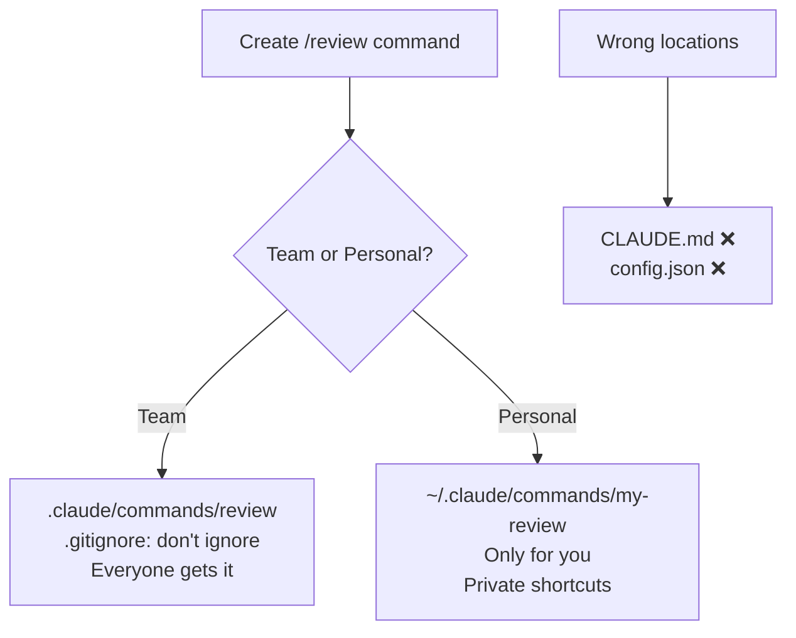
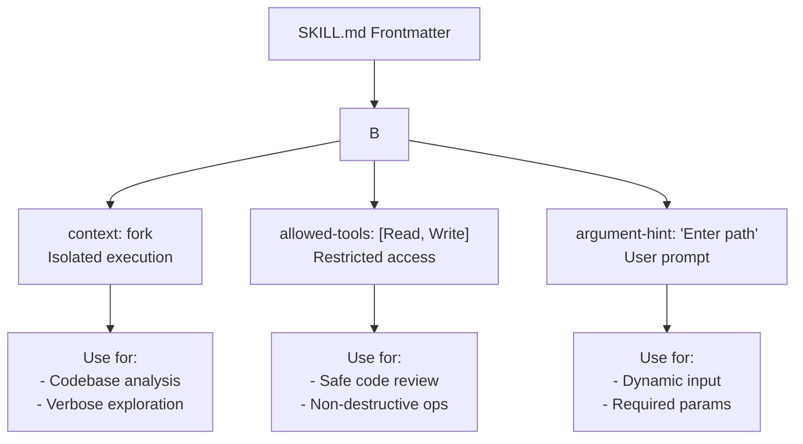
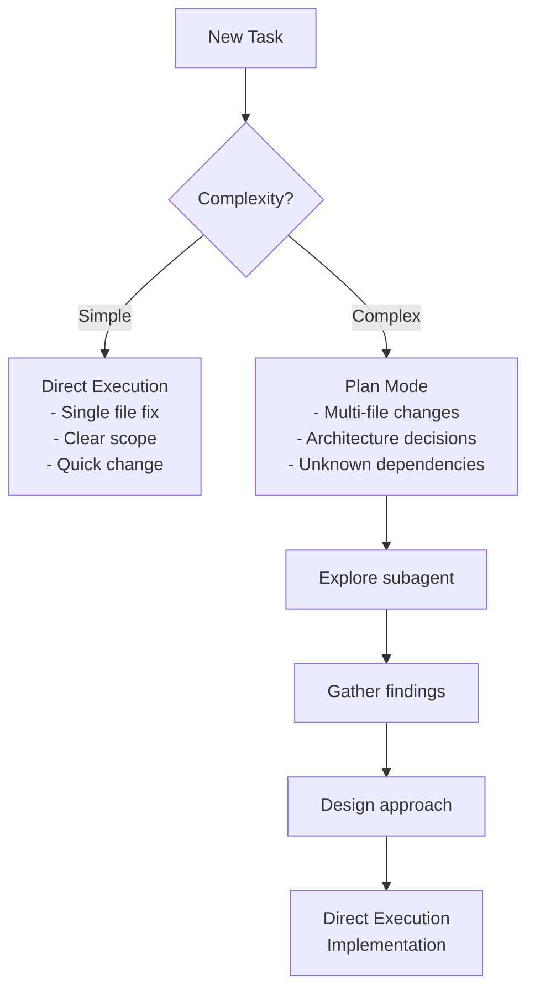
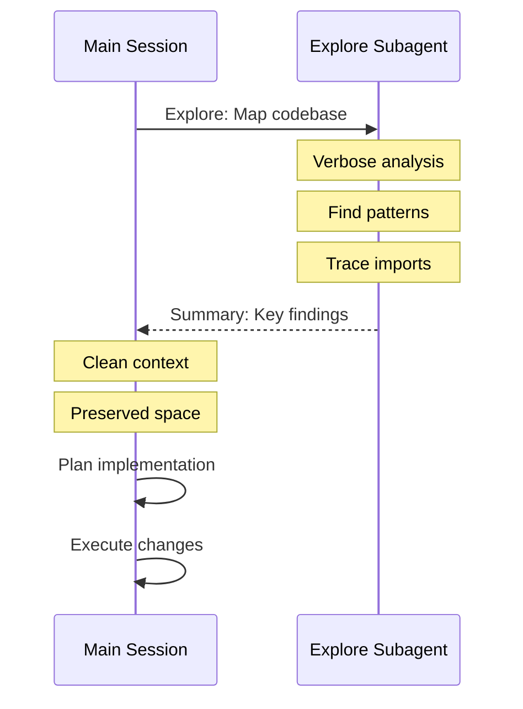
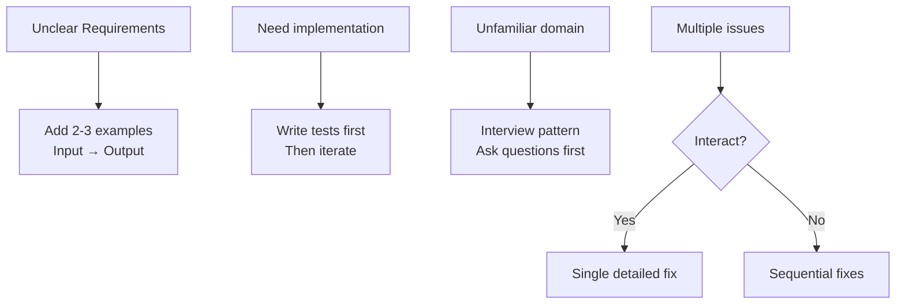
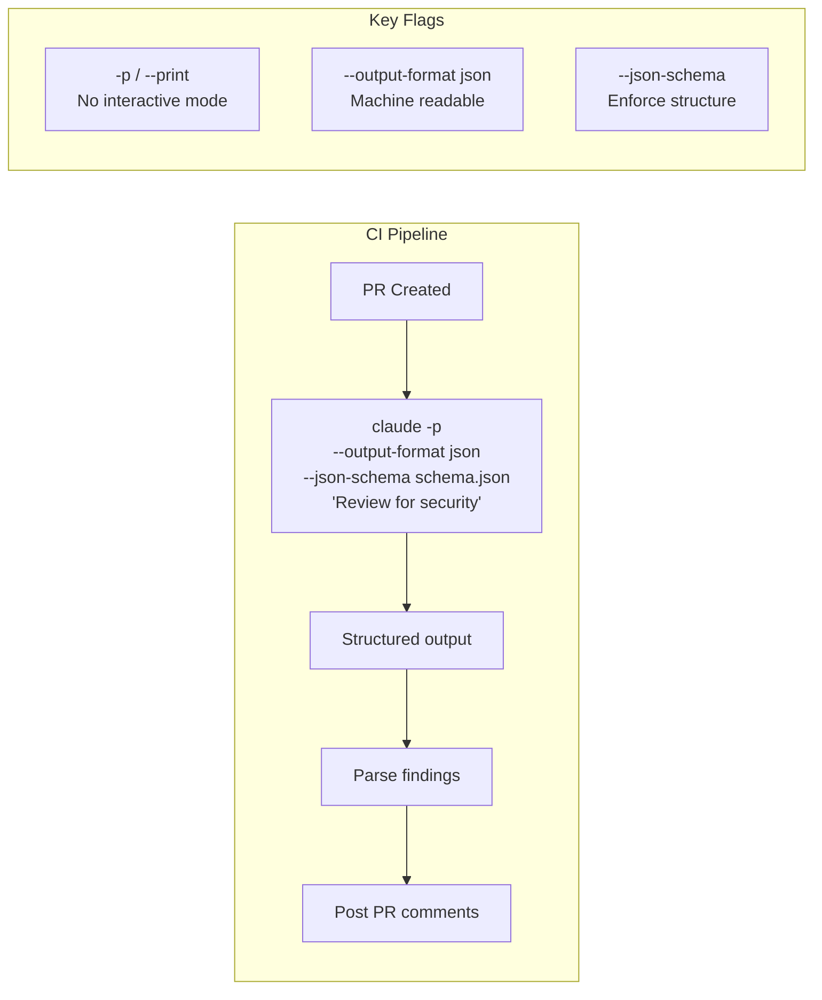

# Domain 3: Claude Code Configuration & Workflows (20%)

---

## Card 3.1: CLAUDE.md Hierarchy

### Question
What's the CLAUDE.md configuration hierarchy?

### Answer
**Configuration levels (highest priority last):**
- **User-level:** `~/.claude/CLAUDE.md` — personal preferences, not shared
- **Project-level:** `.claude/CLAUDE.md` or root `CLAUDE.md` — team standards via version control
- **Directory-level:** Subdirectory `CLAUDE.md` files — specific conventions

### Diagnostic
> Use `/memory` command to verify which memory files are loaded and diagnose inconsistent behavior.

---

## Card 3.2: Topic-Specific Rules

### Question
How do you organize topic-specific rules?

### Answer
**Use .claude/rules/ directory:**
- Files with YAML frontmatter containing glob patterns for conditional activation
- `paths: ["terraform/**/*"]` — loads only when editing matching files
- Alternative to monolithic CLAUDE.md

### Benefits
> Path-scoped rules load only when needed, reducing irrelevant context and token usage. Glob patterns apply conventions to files by type regardless of directory location.

---

## Card 3.3: Slash Command Scope

### Question
Where should custom slash commands be created?

### Answer
**Scope by sharing needs:**
- **Project-scoped:** `.claude/commands/` — shared via version control, available to all developers
- **User-scoped:** `~/.claude/commands/` — personal commands

### Note
> CLAUDE.md is for project instructions and context, not command definitions. There is no .claude/config.json with commands array.

---

## Card 3.4: SKILL.md Frontmatter

### Question
What's the SKILL.md frontmatter configuration?

### Answer
**Available frontmatter options:**
- `context: fork` — runs in isolated sub-agent, prevents output pollution
- `allowed-tools` — restricts tool access during execution
- `argument-hint` — prompts for required parameters

### Use Cases
> Use `context: fork` for skills producing verbose output (codebase analysis) or exploratory context (brainstorming).

---

## Card 3.5: Plan Mode vs Direct Execution

### Question
When should you use plan mode vs direct execution?

### Answer
**Match mode to task complexity:**
- **Plan mode:** Complex tasks with large-scale changes, architectural decisions, multiple valid approaches, multi-file modifications
- **Direct execution:** Simple, well-scoped changes (single-file bug fix, clear stack trace)

### Hybrid Approach
> Use plan mode for investigation, then direct execution for implementation (e.g., planning a library migration, then executing the planned approach).

---

## Card 3.6: Explore Subagent

### Question
What's the Explore subagent used for?

### Answer
**Isolate verbose discovery output:**
- Prevents context window exhaustion during multi-phase tasks
- Returns summaries to preserve main conversation context
- Use during discovery phases before implementation

### Workflow
> Plan mode → Explore subagent for discovery → Summary returned → Direct execution for implementation.

---

## Card 3.7: Iterative Refinement

### Question
What are effective iterative refinement techniques?

### Answer
**Progressive improvement strategies:**
- Provide 2-3 concrete input/output examples when prose descriptions are interpreted inconsistently
- Test-driven iteration: write test suites first, then iterate by sharing test failures
- Interview pattern: have Claude ask questions to surface considerations before implementing

### Issue Management
> Address multiple interacting issues in a single detailed message. Fix independent problems sequentially.

---

## Card 3.8: CI/CD Integration

### Question
How do you integrate Claude Code into CI/CD pipelines?

### Answer
**Non-interactive execution:**
- Use `-p` or `--print` flag to run in non-interactive mode
- Use `--output-format json` with `--json-schema` for machine-parseable structured findings
- CLAUDE.md provides project context (testing standards, review criteria) to CI

### Session Isolation
> Same session that generated code is less effective at reviewing its own changes. Use independent review instance.

