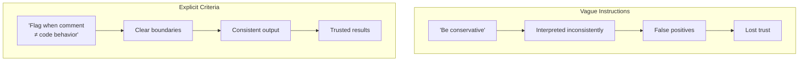
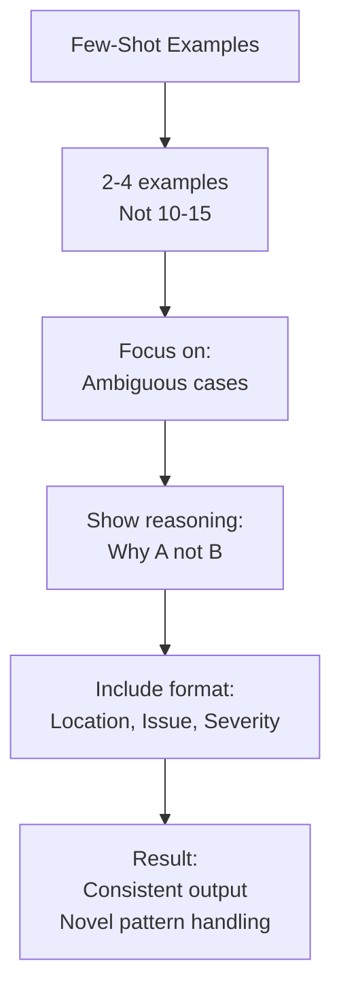
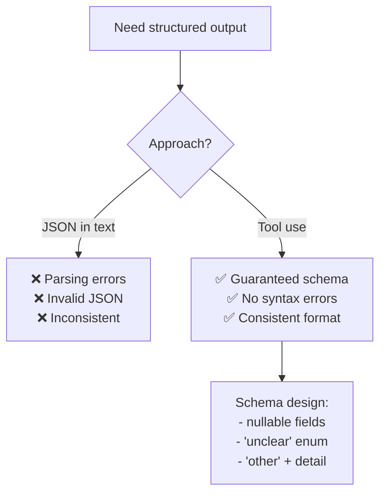
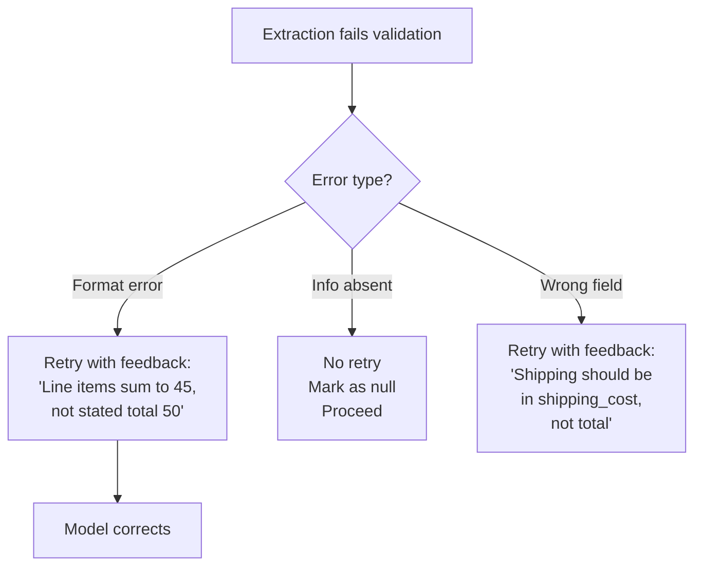
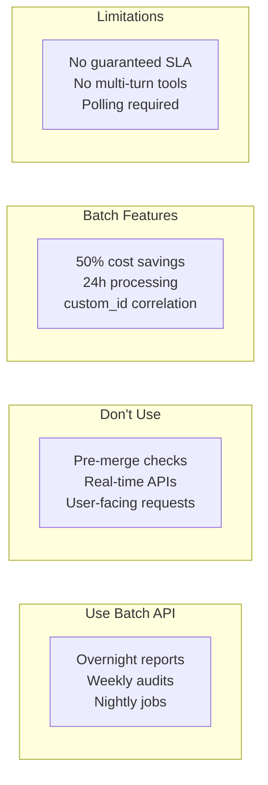
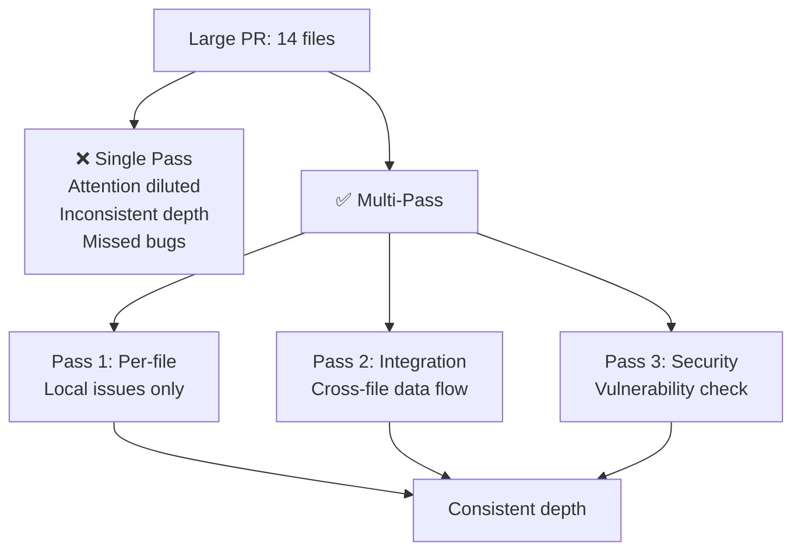

# Domain 4: Prompt Engineering & Structured Output (20%)

---

## Card 4.1: Explicit Criteria

### Question
What's the most effective way to improve prompt precision?

### Answer
**Explicit criteria over vague instructions:**
- "Flag comments only when claimed behavior contradicts actual code behavior" vs "check that comments are accurate"
- Avoid confidence-based filtering like "be conservative" or "only report high-confidence findings"

### False Positive Impact
> High false positive categories undermine developer trust in accurate categories. Temporarily disable high false-positive categories to restore trust while improving prompts.

---

## Card 4.2: Few-Shot Prompting

### Question
How do few-shot examples improve output consistency?

### Answer
**Most effective technique for consistent formatting:**
- 2-4 targeted examples for ambiguous scenarios showing reasoning for choices
- Demonstrate specific desired output format (location, issue, severity, suggested fix)
- Show acceptable patterns vs genuine issues to reduce false positives while enabling generalization

### Key Benefit
> Few-shot examples enable the model to generalize judgment to novel patterns rather than matching only pre-specified cases.

---

## Card 4.3: Structured Output with Tool Use

### Question
What's the most reliable approach for guaranteed structured output?

### Answer
**Tool use with JSON schemas:**
- Eliminates JSON syntax errors entirely
- Strict schemas don't prevent semantic errors (values in wrong fields, line items not summing to total)

### Schema Design
> Use optional/nullable fields when source documents may not contain information (prevents fabrication). Add enum values like "unclear" for ambiguous cases and "other" + detail fields for extensible categorization.

---

## Card 4.4: Validation-Retry Loops

### Question
How do you implement validation-retry loops?

### Answer
**Retry with specific error feedback:**
- Append specific validation errors to the prompt on retry to guide correction
- Send follow-up with original document, failed extraction, and specific validation errors
- Track which errors are resolvable (format mismatches) vs not (information absent)

### When Retries Fail
> Retries are ineffective when required information is simply absent from the source document vs format/structural errors.

---

## Card 4.5: Message Batches API

### Question
When is the Message Batches API appropriate?

### Answer
**50% cost savings for latency-tolerant workloads:**
- **Appropriate:** Overnight reports, weekly audits, nightly test generation
- **Inappropriate:** Blocking workflows, pre-merge checks
- Up to 24-hour processing window, no guaranteed latency SLA

### Limitations
> Batch API does not support multi-turn tool calling within a single request. Use `custom_id` fields to correlate request/response pairs.

---

## Card 4.6: Multi-Pass Review

### Question
How do you design multi-pass review architectures?

### Answer
**Split large reviews into focused passes:**
- Per-file local analysis passes for local issues
- Separate cross-file integration pass for data flow analysis
- Avoids attention dilution and contradictory findings

### Self-Review Limitation
> Independent review instances (without prior reasoning context) are more effective at catching subtle issues than self-review instructions or extended thinking.

