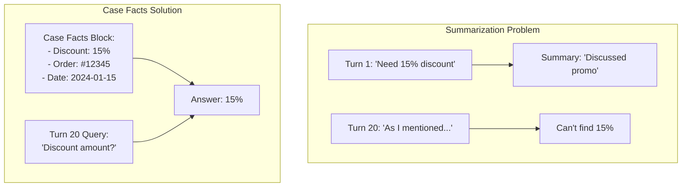
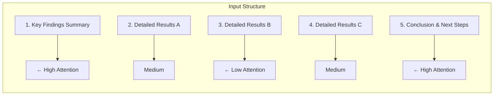
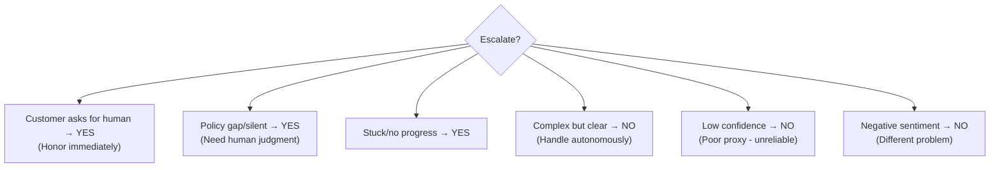
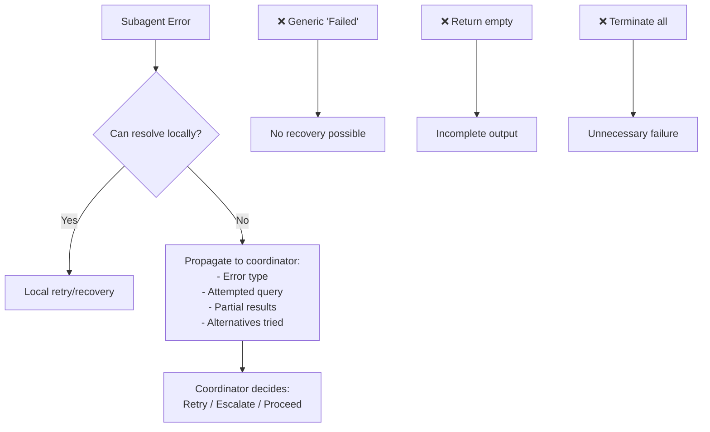
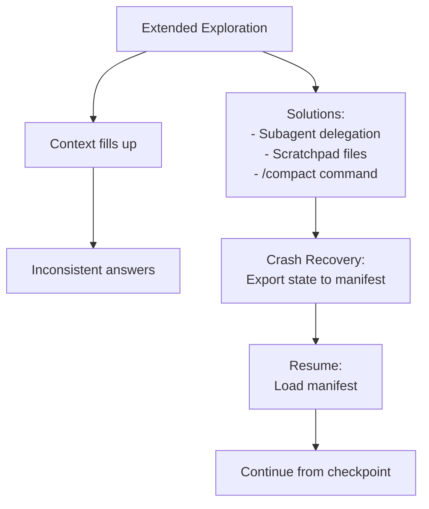
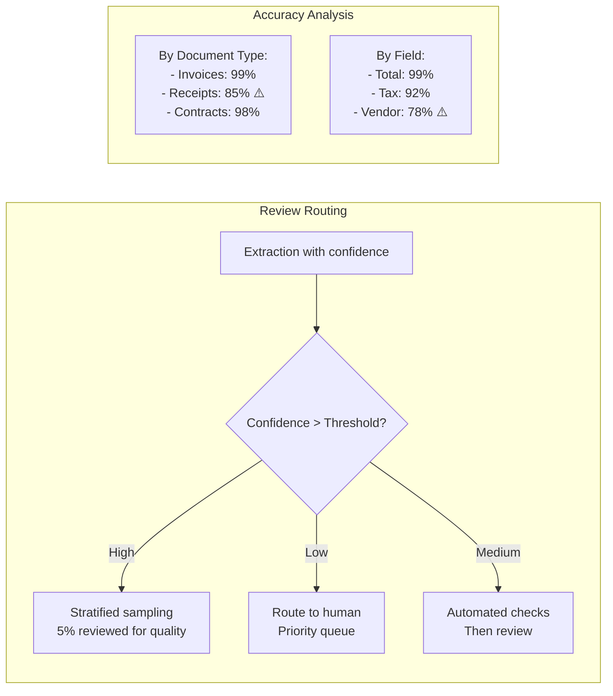
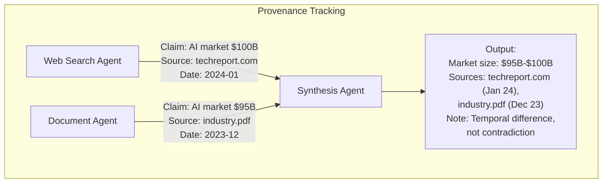

# Domain 5: Context Management & Reliability (15%)

---

## Card 5.1: Progressive Summarization Risks

### Question
What are the risks of progressive summarization?

### Answer
**Fundamental information loss:**
- Condensing numerical values, percentages, dates into vague summaries
- "Discussed promotional pricing" loses the specific 15% discount mentioned
- Cannot reliably "prompt your way out" of information loss

### Solution
> Extract transactional facts (amounts, dates, order numbers) into a persistent "case facts" block included in each prompt, outside summarized history.

---

## Card 5.2: Lost in the Middle Effect

### Question
What's the 'lost in the middle' effect?

### Answer
**Position-based attention degradation:**
- Models reliably process information at beginning and end of long inputs
- May omit findings from middle sections
- Affects long documents and multi-turn conversations

### Mitigation
> Place key findings summaries at beginning of aggregated inputs. Organize detailed results with explicit section headers.

---

## Card 5.3: Escalation Triggers

### Question
When should you escalate to human agents?

### Answer
**Appropriate escalation triggers:**
- Customer explicitly requests a human (honor immediately)
- Policy exceptions/gaps (not just complex cases)
- Inability to make meaningful progress

### Anti-patterns
> Sentiment-based escalation and self-reported confidence scores are unreliable proxies for case complexity. Multiple customer matches require clarification (request additional identifiers) rather than heuristic selection.

---

## Card 5.4: Error Propagation

### Question
How do you propagate errors in multi-agent systems?

### Answer
**Structured error context enables recovery:**
- Include failure type, attempted query, partial results, alternative approaches
- Distinguish access failures (need retry) from valid empty results
- Implement local recovery within subagents before propagating

### Anti-patterns
> Avoid generic error statuses ("search unavailable") that hide context. Don't silently suppress errors (return empty as success) or terminate entire workflows on single failures.

---

## Card 5.5: Large Codebase Context

### Question
How do you manage context in large codebase exploration?

### Answer
**Combat context degradation:**
- Spawn subagents to investigate specific questions while main agent coordinates
- Maintain scratchpad files recording key findings
- Summarize findings before spawning sub-agents for next phase
- Use `/compact` during extended exploration

### Crash Recovery
> Design structured agent state exports (manifests) that coordinator loads on resume and injects into agent prompts.

---

## Card 5.6: Human Review Workflows

### Question
How do you design human review workflows?

### Answer
**Calibrated review routing:**
- Implement stratified random sampling of high-confidence extractions for ongoing error rate measurement
- Analyze accuracy by document type and field before reducing human review
- Output field-level confidence scores and calibrate thresholds using labeled validation sets

### Risk
> Aggregate accuracy metrics (97% overall) may mask poor performance on specific document types or fields.

---

## Card 5.7: Information Provenance

### Question
How do you preserve information provenance in synthesis?

### Answer
**Maintain claim-source mappings:**
- Require subagents to output structured claim-source mappings (source URLs, document names, excerpts)
- Include publication/collection dates to prevent temporal differences being misinterpreted as contradictions
- Annotate conflicting statistics with source attribution rather than arbitrarily selecting one

### Output Structure
> Distinguish well-established findings from contested ones in reports. Preserve original source characterizations and methodological context.

