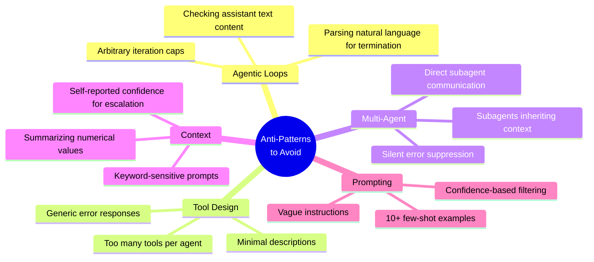
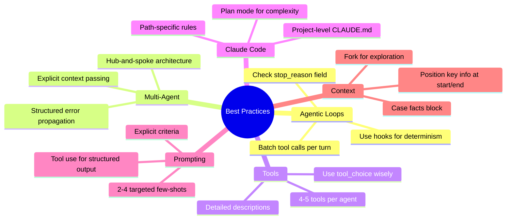

# Quick Reference

---

## Anti-Patterns Summary

---

## Best Practices Summary

---

## Domain Weightings Reference

| Domain | Weight | Cards |
|--------|--------|-------|
| Domain 1: Agentic Architecture & Orchestration | 27% | 9 cards |
| Domain 2: Tool Design & MCP Integration | 18% | 7 cards |
| Domain 3: Claude Code Configuration | 20% | 8 cards |
| Domain 4: Prompt Engineering | 20% | 6 cards |
| Domain 5: Context Management | 15% | 7 cards |

---

## Exam Day Checklist

**Before the Exam:**
- [ ] Review all 5 domains
- [ ] Study the 12 sample questions in official guide
- [ ] Complete hands-on exercises
- [ ] Know the anti-patterns vs best practices

**Key Topics to Master:**
- [ ] `stop_reason` handling (`tool_use` vs `end_turn`)
- [ ] Programmatic vs prompt-based enforcement
- [ ] Hub-and-spoke multi-agent architecture
- [ ] Tool description quality
- [ ] MCP server scoping
- [ ] CLAUDE.md hierarchy
- [ ] Plan mode vs direct execution
- [ ] Tool use for structured output
- [ ] Context window management
- [ ] Escalation triggers

---

*Good luck on your Claude Certified Architect - Foundations exam!*
